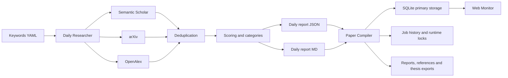

<h1 align="center">Hybrid RAG Research Monitor for Cloud Documentation</h1>

<p align="center">
  <strong>Thesis Paper Agents</strong><br>
  Discovery, ranking, curation and monitoring for a hybrid RAG thesis focused on cloud documentation.
</p>

<p align="center">
  
  
  
  
  
  
</p>

<p align="center">
  <a href="#overview">Overview</a> |
  <a href="#architecture">Architecture</a> |
  <a href="#quick-start">Quick Start</a> |
  <a href="#web-monitor">Web Monitor</a> |
  <a href="#automation">Automation</a> |
  <a href="#project-layout">Project Layout</a>
</p>

## Overview

This repository is a research pipeline for a thesis on hybrid RAG systems over cloud technical documentation across AWS, Azure and Google Cloud.

It is not just a paper scraper. It is an end-to-end workflow that helps you:

- discover recent and foundational papers from multiple academic sources
- reduce noise with thesis-oriented ranking and filtering
- consolidate a local literature database in SQLite
- review papers manually with status, notes and category assignment
- generate reports, APA references, BibTeX and thesis-ready exports
- monitor the pipeline from a local web UI

## Why This Exists

In this thesis, the hard part is not only finding papers. The hard part is separating fast:

- foundational papers
- strong methodological papers
- relevant comparative studies
- recent but still provisional papers
- noisy or peripheral results

This project turns that curation problem into a reproducible workflow with traceability.

## What It Does

| Capability | What it gives you |
|---|---|
| Multi-source discovery | Search across Semantic Scholar, arXiv and OpenAlex |
| Thesis-aware scoring | Prioritize hybrid RAG, retrieval, reranking, embeddings and cloud documentation |
| Indexed deduplication | Remove duplicates efficiently using DOI and normalized title signals |
| SQLite primary storage | Keep a local indexed database with incremental upserts |
| Runtime resilience | Persist cooldowns and provider status across runs |
| Structured job history | Track search, compile and metadata runs in SQLite |
| Web review workflow | Filter, inspect, accept, reject and annotate papers from the browser |
| Thesis exports | Generate reports, APA 7, BibTeX and accepted-paper corpus exports |

## Stack

| Layer | Tools |
|---|---|
| Language | Python 3.11+ |
| Storage | SQLite with FTS5 full-text search + JSON compatibility export |
| APIs | Semantic Scholar, arXiv, OpenAlex, CrossRef |
| Web | FastAPI, Jinja2, HTMX, Uvicorn |
| Reporting | Markdown, BibTeX, APA 7, Mermaid |
| Scheduling | `run_all.py` + Windows Task Scheduler |

## Architecture



## Key Improvements Already Implemented

- Parallel search per provider with persistent provider runtime state.
- Incremental import of daily reports.
- Idempotent report generation and reduced file churn.
- SQLite as primary storage with incremental upsert sync.
- Structured `job_runs` and `runtime_locks` stored in SQLite.
- Responsive web monitor with dashboard, sortable paper table, batch accept/reject operations, paper detail, manual run controls and light/dark theme toggle.
- Proxy-aware links for restricted academic sources.

## Quick Start

### Requirements

- Python 3.11+ recommended
- Internet access for academic APIs
- Optional: `SEMANTIC_SCHOLAR_API_KEY` and `OPENALEX_EMAIL`

### Installation

```bash
python -m venv .venv
.\.venv\Scripts\Activate.ps1
pip install -e .
copy .env.example .env
```

For development (includes linting and testing tools):

```bash
pip install -e ".[dev]"
```

Legacy alternative using `requirements.txt`:

```bash
pip install -r requirements.txt
```

### Daily Search

```bash
python daily_researcher.py
python daily_researcher.py --dry-run
python daily_researcher.py --api openalex
python daily_researcher.py --api-status
```

### Compile and Consolidate

```bash
python paper_compiler.py
python paper_compiler.py --stats
python paper_compiler.py --metadata-status
python paper_compiler.py --sqlite-status
```

### Pipeline by Phases

```bash
python run_all.py
python run_all.py --phase search
python run_all.py --phase compile
python run_all.py --phase metadata
python run_all.py --phase search --phase compile --api openalex
```

## Web Monitor

Run the local UI with:

```bash
python web_monitor.py
```

Main routes:

- `GET /` dashboard
- `GET /papers` paginated paper table with filters
- `GET /papers/{paper_id}` paper detail and review panel
- `GET /jobs` job history and manual execution
- `GET /settings/proxy` local proxy configuration
- `GET /health` healthcheck

The web UI supports:

- filtering by text, status, relevance, API, trust, category, year, DOI verification, Scopus and found date
- sorting visible paper columns from the table header with ascending and descending controls, plus reset to the default ranking order
- switching between light and dark mode with browser-local persistence
- batch accept/reject/reviewed operations via multi-select checkboxes
- editing paper status, notes and thesis categories
- launching manual pipeline runs
- opening direct or proxy-based academic links
- editing local proxy rules from the browser

## Proxy Support

The web UI builds two link modes when possible:

- `Open with proxy`
- `Open direct`

Important:

- this repository does not grant institutional access to anyone
- your university proxy will only work for users who actually have access through that institution
- the proxy feature is a link transformation helper, not an authentication bypass

The proxy layer supports per-domain rules and can now be edited from the web UI in `/settings/proxy`. Local changes are stored outside the base repo config so each user can keep their own institutional setup.

Supported strategies:

1. `host_rewrite`
   - direct: `https://ieeexplore.ieee.org/search/searchresult.jsp?...`
   - proxy: `https://ieeexplore-ieee-org.ezproxy.example.edu/search/searchresult.jsp?...`

2. `prefix`
   - direct: `https://publisher.example/article/123`
   - proxy: `https://proxy.example.edu/login?url=https%3A%2F%2Fpublisher.example%2Farticle%2F123`

Example config:

```yaml
web:
  proxy:
    mode: "dual"
    prefer_proxy_button: true
    rules:
      - name: "Example EZproxy host rewrite"
        strategy: "host_rewrite"
        provider_host: "ezproxy.example.edu"
        domains:
          - "ieeexplore.ieee.org"
          - "dl.acm.org"

      - name: "My custom prefix proxy"
        strategy: "prefix"
        prefix_url: "https://proxy.example.edu/login?url="
        encode_target: true
        domains:
          - "link.springer.com"
          - "www.sciencedirect.com"
```

This means different users can configure different proxies for different domains.

Practical note:

- your idea is correct for restricted publishers such as IEEE, ACM, Springer or ScienceDirect
- for arXiv it is usually unnecessary because arXiv is open access
- so adding a proxy rule for arXiv is possible, but in most cases redundant

The app does not fetch content through the proxy. It only rewrites outbound links.

## Automation

Recommended automation model for v1:

- `Windows Task Scheduler + run_all.py`
- the web UI as the local review and monitoring surface

Suggested scheduled jobs:

```bash
python run_all.py --phase search --phase compile
python run_all.py --phase metadata
```

If one provider is rate-limited, you can also schedule provider-specific runs:

```bash
python run_all.py --phase search --api openalex
python run_all.py --phase search --api arxiv
```

## Outputs

### Daily Outputs

- `output/daily/YYYY-MM-DD_daily_papers.md`
- `output/daily/YYYY-MM-DD_daily_papers.json`
- `output/daily/YYYY-MM-DD_<api>_daily_papers.md`
- `output/daily/YYYY-MM-DD_<api>_daily_papers.json`

### Local Persistence

- `data/papers_database.sqlite` primary storage
- `data/papers_database.json` compatibility export
- `data/api_runtime_state.json` persistent provider runtime state
- `job_runs` table in SQLite for structured execution history
- `runtime_locks` table in SQLite for concurrency control

### Consolidated Reports

- `output/reports/consolidated_report.md`
- `output/reports/gap_analysis.md`
- `output/reports/statistics.md`
- `output/reports/references_apa7.md`
- `output/reports/references.bib`

### Thesis Artifacts

- `output/thesis/`
- `output/rag_corpus/`

## Project Layout

```text
thesis-paper-agents/
|-- assets/
|-- config/
|-- data/
|-- logs/
|-- output/
|-- src/
|   |-- agents/
|   |-- apis/
|   |-- models/
|   |-- utils/
|   `-- web/
|       |-- static/
|       `-- templates/
|-- daily_researcher.py
|-- paper_compiler.py
|-- review_papers.py
|-- export_thesis.py
|-- run_all.py
`-- web_monitor.py
```

## Current Strengths

- strong noise reduction relative to raw academic search volume
- robust deduplication and incremental processing
- SQLite-centered architecture ready for long-term growth
- human-in-the-loop review preserved as a first-class part of the workflow
- web monitoring layer without breaking the CLI workflow

## Current Limits

- scoring is still heuristic, not a learned reranker
- final quality still depends on `keywords.yaml` and `trusted_sources.yaml`
- provisional papers still require academic judgment
- the web UI is intentionally local-first and has no authentication in v1

## Short Roadmap

- measure precision and recall with a manually labeled gold set
- add full-text search if the local database grows further
- separate the bibliographic layer from the future semantic RAG corpus layer
- expand the UI only if manual curation volume justifies it

## Development

```bash
pip install -e ".[dev]"

# Run tests
pytest -v

# Linting
ruff check .
ruff check --fix .

# Formatting
ruff format .
ruff format --check .

# Type checking
mypy src/
```

## Important Note

This project is an academic curation assistant, not a replacement for thesis judgment. Its purpose is to reduce repetitive manual work and improve consistency, not to eliminate critical evaluation.

