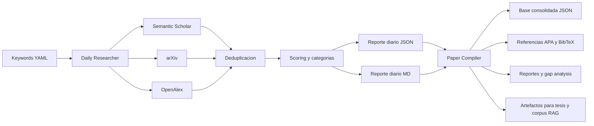

# Thesis Paper Agents

Sistema en Python para descubrir, priorizar, consolidar y exportar papers academicos orientados a una tesis sobre sistemas RAG hibridos.

## Resumen

Este proyecto automatiza la vigilancia bibliografica de una tesis centrada en:

> Diseno y validacion de un modelo semantico hibrido para optimizar sistemas RAG sobre documentacion tecnica cloud en AWS, Azure y Google Cloud, comparandolo con enfoques densos y/o semanticos puros.

No es solo un buscador de papers. Es un pipeline reproducible para:

- buscar papers recientes y fundacionales en multiples fuentes academicas
- reducir ruido con filtros y scoring orientados a la tesis
- consolidar una base local de literatura en JSON
- generar reportes, referencias y artefactos utiles para el estado del arte
- preparar un corpus util para experimentacion futura con RAG

## Estado del proyecto

Estado actual: utilizable y estable para trabajo academico con revision humana.

El pipeline ya incorpora:

- busqueda paralela por API con cache local
- deduplicacion indexada por DOI y titulo normalizado
- scoring heuristico centrado en RAG hibrido, retrieval, reranking, embeddings y documentacion cloud
- penalizacion para papers demasiado aplicados a dominios ajenos al foco de la tesis
- priorizacion de fuentes confiables en el ranking final
- exportacion a Markdown, JSON, APA 7 y BibTeX

La revision humana sigue siendo obligatoria para decidir que papers entran al marco teorico final.

## Problema que resuelve

En una tesis como esta, el problema no es solo encontrar papers. El problema real es separar rapidamente:

- papers fundacionales
- papers metodologicos fuertes
- papers comparativos relevantes
- papers recientes potencialmente utiles pero todavia provisionales
- papers ruidosos o demasiado perifericos

Este proyecto intenta resolver esa curacion de forma sistematica, dejando trazabilidad en cada corrida.

## Flujo general



## Principios de seleccion

El ranking prioriza:

- venues y publishers confiables
- trabajos recientes con senales razonables de impacto
- papers metodologicos sobre retrieval, reranking, chunking, embeddings y evaluacion
- trabajos directamente relacionados con RAG hibrido
- estudios sobre documentacion tecnica, knowledge bases y cloud documentation
- papers fundacionales que cubren gaps del marco teorico

Tambien se penalizan papers que, aunque usan RAG, estan demasiado enfocados en aplicaciones de nicho fuera del foco central de la tesis, por ejemplo medicina, 6G o finanzas, salvo que aporten una contribucion metodologica clara.

## Caracteristicas principales

- `daily_researcher.py`: busca papers nuevos, aplica filtros, genera ranking y escribe reportes diarios.
- `paper_compiler.py`: importa reportes diarios, consolida base de datos, valida metadata y genera reportes acumulados.
- `review_papers.py`: revision interactiva para aceptar o rechazar papers.
- `export_thesis.py`: genera artefactos utiles para redaccion de tesis.
- `search_specific.py`: busqueda puntual por titulo, DOI, autor o keyword.
- `add_manual.py`: agrega papers manualmente si una referencia importante no entro por las APIs.

## Fuentes academicas utilizadas

| Fuente | Uso principal | Comentario |
|---|---|---|
| Semantic Scholar | busqueda principal, metadata y citaciones | muy util para ranking inicial, pero puede rate-limitear sin API key |
| arXiv | recall de novedades en IR, NLP y AI | excelente para detectar trabajo reciente |
| OpenAlex | metadata, DOI y senales bibliometricas | muy util para consolidacion |
| CrossRef | verificacion de DOI | ayuda a limpiar referencias |

## Estructura del repositorio

```text
thesis-paper-agents/
|-- config/
|   |-- config.yaml
|   |-- keywords.yaml
|   `-- trusted_sources.yaml
|-- src/
|   |-- agents/
|   |-- apis/
|   |-- models/
|   `-- utils/
|-- data/
|-- logs/
|-- output/
|   |-- daily/
|   |-- reports/
|   |-- thesis/
|   `-- rag_corpus/
|-- daily_researcher.py
|-- paper_compiler.py
|-- review_papers.py
|-- export_thesis.py
|-- search_specific.py
|-- add_manual.py
`-- run_all.py
```

## Instalacion

### Requisitos

- Python 3.11+ recomendado
- acceso a internet para consultar APIs academicas
- opcional: `SEMANTIC_SCHOLAR_API_KEY` y `OPENALEX_EMAIL` para mejorar estabilidad y rate limits

### Setup rapido

```bash
python -m venv venv
source venv/bin/activate  # Linux/Mac
venv\Scripts\activate     # Windows

pip install -r requirements.txt
cp .env.example .env
```

Variables opcionales de entorno:

- `SEMANTIC_SCHOLAR_API_KEY`
- `OPENALEX_EMAIL`
- `TELEGRAM_BOT_TOKEN`
- `TELEGRAM_CHAT_ID`

## Configuracion

Los archivos mas importantes son:

- `config/config.yaml`: umbrales, concurrencia, APIs, directorios y comportamiento del ranking
- `config/keywords.yaml`: grupos de queries para cada tema de la tesis
- `config/trusted_sources.yaml`: fuentes confiables, categorias y gaps fundacionales

### Parametros importantes de `config/config.yaml`

- `general.search_workers_per_query`: concurrencia por query
- `general.strict_source_filter`: si es `true`, conserva solo fuentes confiables
- `general.untrusted_keep_score_threshold`: minimo score para conservar papers no confiables
- `general.min_keep_score`: corte minimo final despues del scoring
- `general.provisional_ranking_penalty`: castiga papers provisionales en el ranking final
- `general.missing_doi_ranking_penalty`: castiga papers sin DOI al ordenar tops y reportes
- `general.missing_venue_ranking_penalty`: castiga papers sin venue claro
- `apis.semantic_scholar.max_retries_without_key`: limite de reintentos sin API key
- `apis.semantic_scholar.cooldown_seconds`: apagado temporal ante demasiados `429`
- `apis.semantic_scholar.shutdown_after_consecutive_failures`: cuantas queries fallidas tolerar antes de desactivar temporalmente esa API

### Recomendaciones practicas de calibracion

- Para exploracion amplia: `strict_source_filter: false`
- Para filtrado muy conservador: `strict_source_filter: true`
- `min_keep_score: 35` es un buen punto de partida si quieres priorizar calidad sobre recall
- Si ves muchos provisionales arriba en el top diario, sube `provisional_ranking_penalty`
- Si no tienes `SEMANTIC_SCHOLAR_API_KEY`, deja los reintentos bajos para no perder tiempo en `429`

## Uso

### 1. Busqueda diaria

```bash
python daily_researcher.py
python daily_researcher.py --days 30
python daily_researcher.py --dry-run
python daily_researcher.py --schedule 08:00
```

### 2. Compilacion y consolidacion

```bash
python paper_compiler.py
python paper_compiler.py --review
python paper_compiler.py --stats
python paper_compiler.py --export-apa
python paper_compiler.py --export-bibtex
python paper_compiler.py --gap-analysis
```

### 3. Pipeline completo

```bash
python run_all.py
python run_all.py --notify
python run_all.py --dry-run
python run_all.py --search-only
python run_all.py --compile-only
python run_all.py --days 14
```

### 4. Busqueda puntual

```bash
python search_specific.py --title "Sentence-BERT: Sentence Embeddings using Siamese BERT-Networks"
python search_specific.py --author "Khattab" --keyword "ColBERT"
python search_specific.py --doi "10.1145/3397271.3401075"
```

### 5. Carga manual

```bash
python add_manual.py --doi "10.1145/3397271.3401075"
python add_manual.py --title "Paper Title" --authors "Author1, Author2" --year 2024 --venue "IEEE"
```

## Outputs generados

### Reportes diarios

- `output/daily/YYYY-MM-DD_daily_papers.md`: reporte legible para revision humana
- `output/daily/YYYY-MM-DD_daily_papers.json`: salida estructurada para importacion automatica

### Reportes consolidados

- `output/reports/consolidated_report.md`
- `output/reports/gap_analysis.md`
- `output/reports/statistics.md`
- `output/reports/references_apa7.md`
- `output/reports/references.bib`

### Artefactos de tesis

- `output/thesis/`
- `output/rag_corpus/`

## Flujo recomendado de trabajo

1. Ejecutar `python daily_researcher.py --dry-run` para inspeccionar el volumen y el top del dia.
2. Ejecutar `python daily_researcher.py` si el resultado luce razonable.
3. Ejecutar `python paper_compiler.py` para consolidar los nuevos papers.
4. Revisar `python paper_compiler.py --stats` y, si hace falta, `python paper_compiler.py --gap-analysis`.
5. Usar `review_papers.py` para aceptar o rechazar papers importantes.
6. Exportar referencias o artefactos para la tesis cuando toque redactar.

## Calidad actual y limites

Fortalezas actuales:

- buena reduccion de ruido frente al volumen bruto de resultados
- deduplicacion rapida y bastante robusta
- buen equilibrio entre recall y filtro conservador
- pipeline reproducible y facil de inspeccionar porque usa archivos simples

Limitaciones actuales:

- el scoring sigue siendo heuristico; no es un reranker entrenado
- la calidad final depende de `keywords.yaml` y `trusted_sources.yaml`
- los papers `provisional` no deben tomarse como evidencia fuerte sin revision
- puede seguir entrando algun paper aplicado fuera del foco si tiene una contribucion metodologica fuerte
- la revision humana sigue siendo necesaria para decisiones academicas finales

## Roadmap corto

- migrar la base local de JSON a SQLite para mejorar escalabilidad y trazabilidad
- crear un gold set manual para medir precision de la seleccion
- separar la ingesta en jobs idempotentes por API
- incorporar interfaz de curacion para aceptar, rechazar y etiquetar papers
- separar la capa bibliografica de la capa de corpus semantico para RAG experimental

## Nota importante

Este proyecto esta pensado como asistente de curacion academica, no como sustituto del juicio del tesista. El objetivo es reducir trabajo manual repetitivo y mejorar consistencia, no eliminar la evaluacion critica.